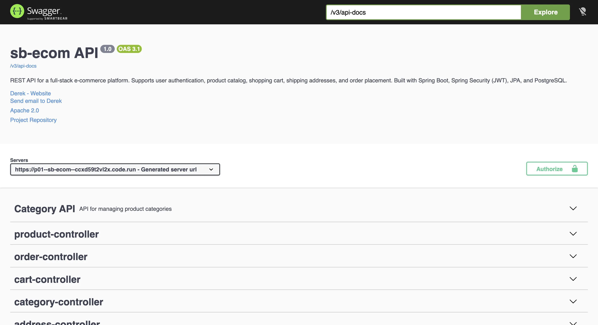

# E-Shop — Spring Boot API

[](https://github.com/Derek376/sb-ecom/actions/workflows/backend-ci.yml)

The API behind a deployed multi-role e-commerce application. It handles the
catalogue, carts, addresses, orders, media, authentication, and Stripe payment
verification for the React storefront.

[Live storefront](https://react-ecom-zeta.vercel.app) ·
[Swagger API](https://p01--sb-ecom--ccxd59t2vl2x.code.run/swagger-ui/index.html) ·
[Frontend repository](https://github.com/Derek376/react-ecom)

## What I wanted to solve

The main question behind this API was not “how many CRUD endpoints can I add?”
It was “what must the server prove before it changes protected data?” That led
to explicit ownership queries, server-authoritative payment amounts, locked
inventory rows, stable pagination, and tests around role boundaries.

## Trust boundaries

**Authentication.** The JWT is stored in a secure HTTP-only cookie instead of
being exposed to frontend JavaScript. Cross-origin state changes also require a
CSRF token. Passwords are hashed with BCrypt.

**Authorization.** URL rules separate `USER`, `SELLER`, and `ADMIN`, while the
service/repository layer checks ownership. A valid JWT alone does not allow one
user to edit another user's address or a seller to modify another seller's
product.

**Payments.** Stripe amounts are calculated from the server-side cart. Before
an order is created, the API retrieves the PaymentIntent and verifies status,
amount, currency, user metadata, and cart metadata. PaymentIntent IDs are unique,
so repeating the confirmation request does not create another order.

**Money and stock.** Prices and totals use `BigDecimal` with explicit database
precision. Order creation runs in a transaction and locks product rows before
checking and decrementing stock.

**Queries and media.** Sort fields are allowlisted and receive an ID-based
secondary sort, preventing equal values from jumping between pages. Product
images live in Cloudinary rather than the container filesystem.

## API tour

### OpenAPI documentation



### Continuous integration


## Architecture

```text
React client
    │ HTTPS + JWT cookie + CSRF header
    ▼
Spring Security filter chain
    ▼
Controllers → Services → JPA repositories → PostgreSQL (Neon)
                  ├── Stripe API
                  └── Cloudinary
```

| Area | Technology |
|---|---|
| Runtime | Java 21, Spring Boot 4 |
| Persistence | Spring Data JPA, Hibernate, PostgreSQL |
| Security | Spring Security, JJWT, BCrypt, CSRF |
| Integrations | Stripe Java SDK, Cloudinary Java SDK |
| API documentation | SpringDoc OpenAPI / Swagger |
| Tests | JUnit 5, Mockito, MockMvc, Spring Security Test, H2 |
| Delivery | Maven, Docker, GitHub Actions, Northflank, Neon |

## Main API surface

All routes start with `/api`.

| Area | Access | Examples |
|---|---|---|
| Authentication | Public | `POST /auth/signup`, `POST /auth/signin` |
| Catalogue | Public | `GET /public/products`, `GET /public/categories` |
| Cart and addresses | User | `GET /carts/users/cart`, `POST /addresses` |
| Checkout and orders | User | `POST /order/stripe-client-secret`, `POST /orders` |
| Seller operations | Seller | Owned product CRUD and seller-visible orders |
| Administration | Admin | Sellers, categories, orders, analytics |

Interactive request and response schemas are available through Swagger.

## Run locally

Requirements: Java 21 and PostgreSQL.

```bash
cp src/main/resources/application-local.properties.example \
   src/main/resources/application-local.properties
./mvnw spring-boot:run
```

Configure the local file with PostgreSQL credentials plus:

```properties
spring.app.jwtSecret=REPLACE_WITH_A_BASE64_SECRET
stripe.secret.key=sk_test_...
app.jwt.cookie.secure=false
app.jwt.cookie.same-site=Lax
cloudinary.cloud-name=...
cloudinary.api-key=...
cloudinary.api-secret=...
```

Generate a signing secret with `openssl rand -base64 64`. Local Swagger is at
`http://localhost:8080/swagger-ui/index.html`.

## Verification

```bash
./mvnw --batch-mode --no-transfer-progress verify
```

The current suite has **41 tests** across authentication, authorization,
ownership, seller creation, Stripe verification, order finalisation, stock
handling, stable sorting, precise monetary rounding, and application startup.
Stripe responses are mocked; persistence-backed security tests use an isolated
H2 database. GitHub Actions runs the full Maven verification lifecycle and
packages the executable JAR.

## Production shape

The API is packaged as a Docker image and deployed to Northflank. Runtime data
uses Neon PostgreSQL, while Cloudinary keeps media independent of container
replacement.

Required production secrets/configuration:

| Variable | Purpose |
|---|---|
| `SPRING_DATASOURCE_URL`, `SPRING_DATASOURCE_USERNAME`, `SPRING_DATASOURCE_PASSWORD` | Neon connection |
| `SPRING_APP_JWTSECRET` | JWT signing key |
| `STRIPE_SECRET_KEY` | Stripe test secret |
| `FRONTEND_URL` | Exact allowed Vercel origin |
| `CLOUDINARY_CLOUD_NAME`, `CLOUDINARY_API_KEY`, `CLOUDINARY_API_SECRET` | Media storage |
| `APP_JWT_COOKIE_SECURE=true` | HTTPS-only auth cookie |
| `APP_JWT_COOKIE_SAME_SITE=None` | Cross-site SPA cookie |

Secrets are supplied by the deployment platform and are never committed or
sent to the React application.

## Related

- [React frontend](https://github.com/Derek376/react-ecom)
- [Derek376 on GitHub](https://github.com/Derek376)

MIT — see [LICENSE](LICENSE).
